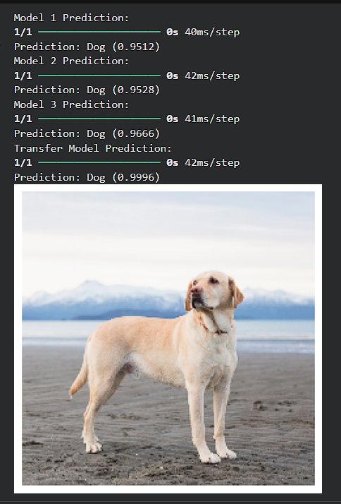

# 🐶🐱 Dogs vs Cats Image Classification using CNN

This project implements multiple Convolutional Neural Network (CNN) models to classify images of dogs and cats.

The goal of the project is to experiment with different CNN architectures and compare them with a transfer learning approach using MobileNetV2.

---

## 📊 Model Performance

| Model | Description | Validation Accuracy |
|------|-------------|--------------------|
| Model 1 | Baseline CNN | 81.81% |
| Model 2 | Larger CNN | 78.85% |
| Model 3 | Tuned CNN (Dropout + smaller learning rate) | 84.19% |
| Model 4 | Transfer Learning (MobileNetV2) | **97.52%** |

Transfer learning significantly outperformed CNN models trained from scratch.

---

## 🧠 Models Implemented

### 1. Baseline CNN
A simple CNN architecture with three convolutional layers.

### 2. Larger CNN
A deeper CNN with increased filters to improve feature extraction.

### 3. Tuned CNN
This model introduces dropout and a smaller learning rate to improve generalization and reduce overfitting.

### 4. Transfer Learning (MobileNetV2)
A pretrained MobileNetV2 model trained on ImageNet is used as a feature extractor. Only the classification head is trained for the Dogs vs Cats dataset.

---

## 📷 Example Prediction

Below is an example prediction from all four models.

The transfer learning model produces the most confident and accurate prediction.

---

## 📂 Dataset

The dataset used in this project is the **Dogs vs Cats dataset**.

Download it from Kaggle:

https://www.kaggle.com/datasets/bhavikjikadara/dog-and-cat-classification-dataset

After downloading, the dataset should be placed in the following structure:

PetImages/
- Cat/
- Dog/

---

## ⚙️ Installation

Clone the repository:

git clone https://github.com/jenishdotdev/dogs-vs-cats-cnn-classifier.git

Then install the required libraries:

pip install -r requirements.txt

---

## 🚀 Running the Project

Open the notebook:

dogs_vs_cats_cnn.ipynb

Run all cells to train the models.

To test the model with a custom image, place an image in the project folder and run:

predict_image(model3, "test_image.jpg")

---

## 🛠 Technologies Used

- Python  
- TensorFlow / Keras  
- Convolutional Neural Networks (CNN)  
- Transfer Learning  
- MobileNetV2  
- Matplotlib  

---

## 👤 Author
Jenish Bhati
